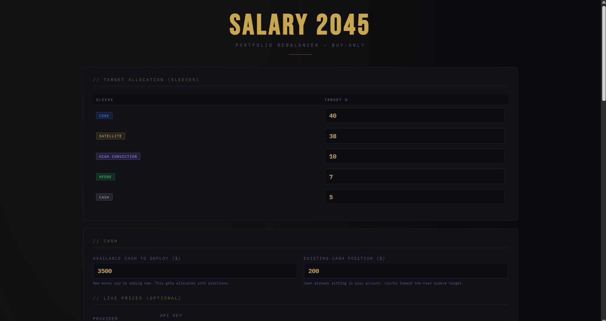
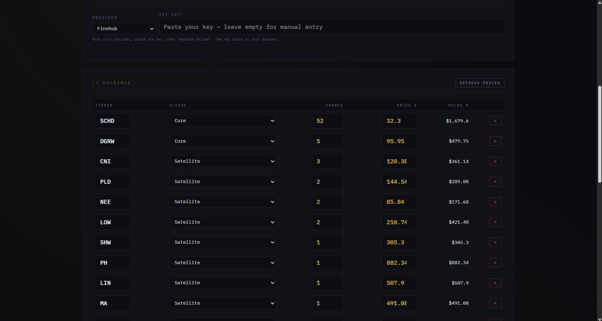
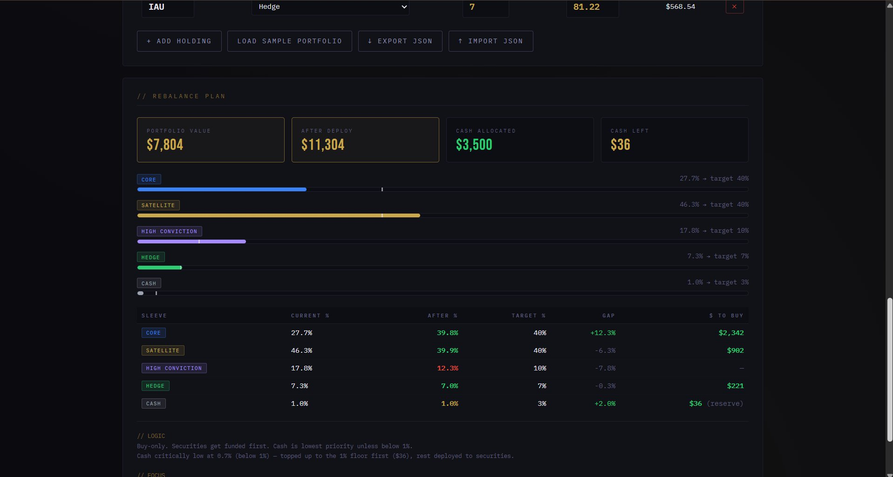

# Salary2045 — Portfolio Rebalancer

A free, browser-based tool that tells you where to deploy new cash in your investment portfolio to stay on target — without selling anything.

🔗 **[Live Demo → gavrielp1.github.io/Salary2045-Rebalancer](https://gavrielp1.github.io/Salary2045-Rebalancer)**

---


<table>
  <tr>
    <td><br/><sub><b>Set sleeves and enter cash</b></sub></td>
    <td><br/><sub><b>Enter holdings and refresh prices</b></sub></td>
    <td><br/><sub><b>Get the rebalance plan</b></sub></td>
  </tr>
</table>

---

## What It Does

Most rebalancing tools tell you to sell overweight positions and buy underweight ones. This tool doesn't. It takes a **buy-only** approach: you enter how much new cash you have to deploy, and the tool tells you exactly where to put it to move your portfolio closer to your target allocation — without triggering any sales or tax events.

---

## How to Use It

1. **Set your target allocation** — Define your sleeves and the % you want each to represent.
2. **Enter your cash** — How much new money you're adding, and how much cash already sits in your account.
3. **Enter your holdings** — Ticker, sleeve, number of shares, and price.
4. **Read the plan** — The tool tells you exactly how many dollars to deploy into each sleeve.

No account, no login, no server. Everything runs locally in your browser.

---

## Sections

### 1. Target Allocation (Sleeves)

Sleeves are the categories you define for your portfolio. Each sleeve has a name, a target %, and a color. The default structure is:

| Sleeve | Default Target | Purpose |
|---|---|---|
| **Core** | 40% | Stable, diversified — index funds, dividend ETFs |
| **Satellite** | 38% | Individual stocks with long-term conviction |
| **High Conviction** | 10% | Higher-risk, higher-upside positions |
| **Hedge** | 7% | Defensive assets — gold, inverse ETFs |
| **Cash** | 5% | Liquidity buffer for fees, taxes, opportunities |

All percentages are fully adjustable. The tool warns you if they don't sum to 100%.

You can **add** new sleeves (+ Add Sleeve), **rename** them, **recolor** them, and **delete** any sleeve except Cash. Cash is always the last sleeve and has its own priority logic (see Allocation Logic below).

---

### 2. Cash

Two separate fields:

- **Available Cash to Deploy** — new money you're adding now. This is what the tool allocates into positions.
- **Existing Cash Position** — cash already sitting in your brokerage account. This counts toward the Cash sleeve target and is factored into the current allocation calculation before any buying.

---

### 3. Live Prices (Optional)

Choose a data provider and paste your API key to refresh prices automatically. Supported providers:

| Provider | Notes |
|---|---|
| **Finnhub** ✅ Recommended | Real-time for US stocks, 60 calls/min free tier, CORS-friendly |
| **Twelve Data** | Real-time, 800 calls/day free tier, CORS-friendly |
| **Financial Modeling Prep** | EOD only, free tier, CORS-friendly |
| **Alpha Vantage** | 15-20 min delayed, 25 calls/day free tier |
| **Tiingo** | Free tier, may be CORS-blocked in browser |
| **Polygon** | Free tier, may be CORS-blocked in browser |

If you leave the API key empty, enter prices manually. All providers are modular — if one stops working, switch from the dropdown without touching any code.

> ⚠️ Never commit a real API key to a public repo. Leave the API key field empty before publishing.

**Note on free API reliability:** Free tiers are not always accurate for real-time data. For a rebalancer you run once a month, entering prices manually from Yahoo Finance or Google Finance takes under 2 minutes and is more reliable.

---

### 4. Holdings

Enter your current positions: ticker, sleeve, number of shares, and price. The tool calculates the value of each position automatically.

- **+ Add Holding** — add a new empty row
- **Load Sample Portfolio** — loads a pre-built example portfolio to explore the tool
- **↓ Export JSON** — saves a snapshot of your entire portfolio to a file
- **↑ Import JSON** — restores a previously exported snapshot
- **✕** — remove a holding

---

### 5. Rebalance Plan

The output section shows:

- **Portfolio Value** — total current value of all holdings + existing cash
- **After Deploy** — portfolio value after the new cash is added
- **Cash Allocated** — how much of the new cash gets deployed into securities
- **Cash Left** — amount reserved for the Cash sleeve (if applicable)

**Visual bars** show each sleeve's current allocation vs. its target. The white marker on each bar is the target — if the bar falls short, that sleeve is underweight.

**The plan table** breaks down exactly how much to buy in each sleeve:

| Column | Meaning |
|---|---|
| Current % | Sleeve's share of the portfolio right now |
| After % | Projected share after this deployment (green = near target, red = over, gold = still under) |
| Target % | Your defined goal |
| Gap | How far off the sleeve is (green = underweight = needs buying) |
| $ To Buy | How much of the new cash goes to this sleeve |

---

## Allocation Logic (Full Detail)

### Step 1 — Calculate the base

```
totalAfter = current portfolio value + new cash to deploy
```

For each sleeve:
```
target value  = totalAfter × sleeve target%
current value = sum of (shares × price) for all holdings in that sleeve
gap           = target value − current value  (negative = overweight)
```

Cash sleeve current value = existingCash (it's already in the account, not a holding).

---

### Step 2 — Cash priority (three-tier system)

Cash is evaluated **before** allocating to securities, using this formula:

```
cashPct = existingCash / totalAfter × 100
```

Note: new cash is **not** added to the numerator — it's the money being allocated, not money already in the account.

| Cash level | Condition | Action |
|---|---|---|
| **Critically low** | cashPct < 1% | Cash gets funded **first**, but only up to the 1% floor. The remainder is deployed to securities. |
| **Normal** | 1% ≤ cashPct < target% | Cash gets funded **last** — only after all securities sleeves are fully covered. |
| **Overfunded** | cashPct ≥ target% | Cash gets **nothing**. Already at or above target. |

**Why this way:** Cash is a drag on returns. The goal is to keep just enough for fees and opportunities, not to prioritize it. Only if cash drops below 1% is it treated as urgent.

**Example:**
- Portfolio now: $7,804. New cash: $30. totalAfter = $7,834.
- Existing cash: $77.5 → cashPct = $77.5 / $7,834 = **0.99%** → below 1% → critically low
- 1% floor = $78.34 → cash needs $0.84 to reach the floor
- Cash gets $0.84 first. Remaining $29.16 goes to securities.

---

### Step 3 — Deploy to securities

After the cash tier is resolved, the remaining new money goes to non-cash sleeves:

**If there are undershooting sleeves and not enough money to fill all gaps:**
```
each sleeve gets = remaining × (sleeve gap / sum of all gaps)
```
Biggest gap gets the most. Overweight sleeves get nothing.

**If there's more money than needed to fill all gaps:**
1. All gaps are filled first.
2. Leftover is spread by target weight among all non-cash sleeves:
```
each sleeve gets += leftover × (sleeve target% / sum of non-cash target%)
```

**If all non-cash sleeves are at or above target:**
- Top up cash if still below target (CASE 2 — normal range).
- Spread any further remainder by target weight.

---

### Step 4 — After % calculation

For each sleeve, the projected allocation after deployment:
```
after value = current value + buy amount
after %     = after value / totalAfter × 100
```

Color coding: green = within 0.5% of target, red = over target, gold = still under target.

---

## The JSON File

### What it is

A portable snapshot of your entire portfolio at a specific moment. Contains your sleeve definitions, target percentages, all holdings (ticker, sleeve, shares, price), and cash values.

### Structure

```json
{
  "exported": "2026-06-07",
  "sleeves": [
    { "key": "sl_1", "name": "Core",      "color": "#3b82f6", "target": 40, "isCash": false },
    { "key": "sl_2", "name": "Satellite", "color": "#c9a84c", "target": 38, "isCash": false },
    { "key": "sl_5", "name": "Cash",      "color": "#9ca3af", "target":  3, "isCash": true  }
  ],
  "holdings": [
    { "ticker": "SCHD", "sleeveKey": "sl_1", "shares": "52", "price": "27.70" },
    { "ticker": "IAU",  "sleeveKey": "sl_4", "shares": "7",  "price": "81.22" }
  ],
  "cash": "500",
  "existingCash": "77.5"
}
```

### What it is NOT

It does not update automatically. It is not connected to any broker or market feed. It is a manual backup you create by clicking **↓ Export JSON**.

### When to export

Export after every session where you updated prices, added holdings, or changed targets. Files are named `salary2045_YYYY-MM-DD.json` automatically. Keep multiple versions by date as a history.

### How to import

Click **↑ Import JSON**, select your file. All sleeves and holdings are restored exactly as exported.

---

## Data Storage

All data saves automatically to your browser's **localStorage** after every change. Close and reopen the file from the same location on your computer — everything is exactly as you left it.

**localStorage is tied to the file path and browser.** If you move the file, open it in a different browser, or clear browser history, the data will not follow. Use Export JSON for a portable backup.

---

## Privacy

- No server, no database, no analytics
- All calculations run locally in your browser
- Nothing leaves your machine except optional API price requests sent directly to the chosen provider
- API keys are stored only in your browser session — never hardcoded, never logged

---

## Tech Stack

Single HTML file — HTML, CSS, vanilla JavaScript. No frameworks, no build tools, no dependencies. Open directly in any modern browser. Works offline after the first load.

---

## License

MIT — free to use, fork, and modify.
