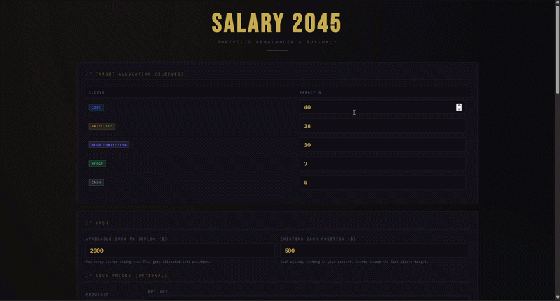
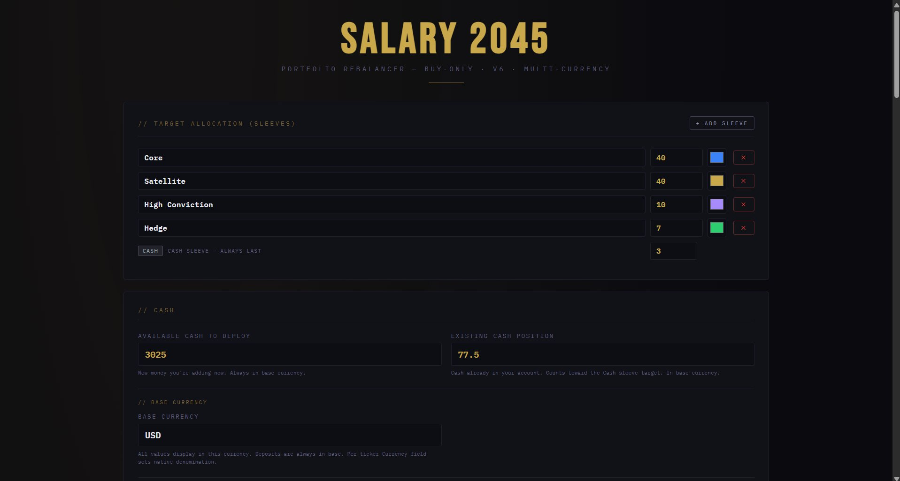
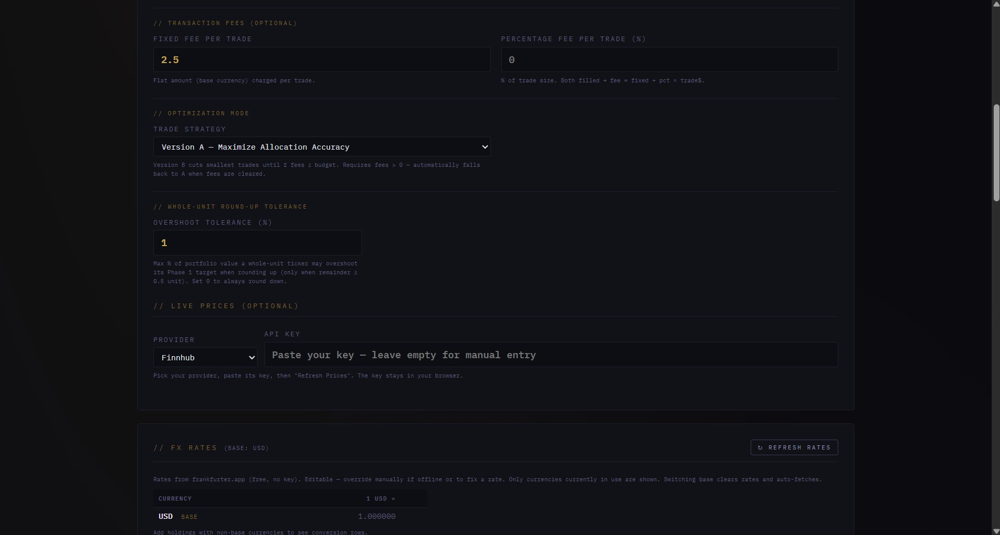
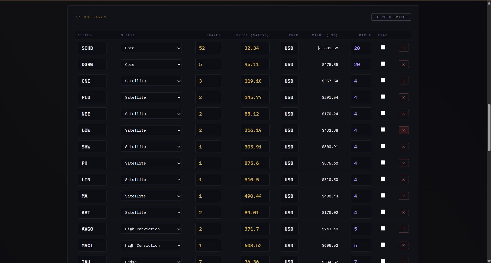
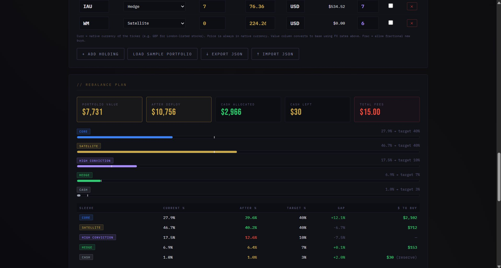
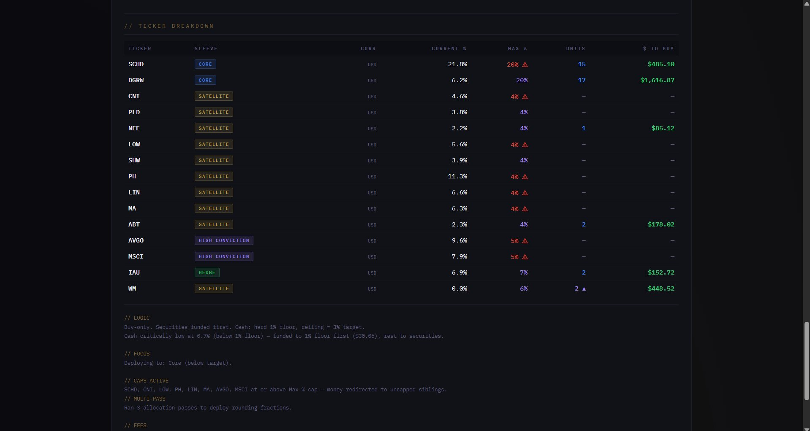

# Salary2045 — Portfolio Rebalancer

A free, browser-based tool that tells you where to deploy new cash in your investment portfolio to stay on target — without selling anything. Buy-only, multi-currency, fee-aware.

🔗 **[Live Demo → gavrielp1.github.io/Salary2045-Rebalancer](https://gavrielp1.github.io/Salary2045-Rebalancer)**

---



<table>
  <tr>
    <td><br/><sub><b>Set sleeves, cash, and base currency</b></sub></td>
    <td><br/><sub><b>Configure fees, mode, and FX rates</b></sub></td>
    <td><br/><sub><b>Enter holdings, currencies, and caps</b></sub></td>
  </tr>
  <tr>
    <td><br/><sub><b>Read the rebalance plan</b></sub></td>
    <td><br/><sub><b>Per-ticker breakdown and logic notes</b></sub></td>
    <td></td>
  </tr>
</table>

---

## What It Does

Most rebalancing tools tell you to sell overweight positions and buy underweight ones. This tool doesn't. It takes a **buy-only** approach: you enter how much new cash you have to deploy, and the tool tells you exactly where to put it to move your portfolio closer to your target allocation — without triggering any sales or tax events.

Over time, as you add money regularly (e.g. monthly salary savings), your portfolio gradually converges to your target without ever selling.

---

## How to Use It

1. **Set your target allocation** — define your sleeves and the % you want each to represent.
2. **Enter your cash** — how much new money you're adding, and how much cash already sits in your account.
3. **Enter your holdings** — ticker, sleeve, shares, price, currency, and optional cap.
4. **Read the plan** — the tool tells you exactly how many units and how many dollars to deploy into each position.

No account, no login, no server. Everything runs locally in your browser.

---

## Features

The tool has grown through five build stages. Here is everything it currently does.

### Dynamic Sleeves

Sleeves are the categories you define for your portfolio. Each has a name, target %, and color. The default structure is:

| Sleeve | Default Target | Purpose |
|---|---|---|
| **Core** | 40% | Stable, diversified — index funds, dividend ETFs |
| **Satellite** | 40% | Individual stocks with long-term conviction |
| **High Conviction** | 10% | Higher-risk, higher-upside positions |
| **Hedge** | 7% | Defensive assets — gold, inverse ETFs |
| **Cash** | 3% | Liquidity buffer for fees, taxes, opportunities |

All percentages are adjustable. The tool warns you if they don't sum to 100%. You can add, rename, recolor, and delete any sleeve except Cash, which is always last and has its own priority logic.

### Three-Tier Cash Priority

Cash is treated like a tax-bracket system, evaluated against `totalAfter` (portfolio value after the new cash is added):

| Cash level | Condition | Action |
|---|---|---|
| **Critically low** | below 1% | Funded **first**, but only up to the 1% floor. The rest goes to securities. |
| **Normal** | 1% to target % | Funded **last** — only after all securities sleeves are covered. |
| **Overfunded** | at or above target % | Gets **nothing**. Already at or above target. |

Cash is a drag on returns, so the tool keeps just enough for fees and opportunities. Only when it drops below 1% is it treated as urgent.

### Per-Ticker Max % Cap

Each holding has an optional **Max %** field — the maximum share of the total portfolio that position is allowed to reach. If a stock is already at or above its cap, it receives zero new allocation, and the money is redirected to uncapped siblings in the same sleeve through an iterative overflow-redistribution algorithm. This is the difference between sleeve-level discipline and position-level discipline.

### Transaction Fees

Optional fixed and/or percentage fees per trade:

```
Fee per trade = Fixed Fee + (Percentage Fee ÷ 100) × trade amount
```

Fees are paid through a cascade: cash reserve → existing cash → raid stock allocation. A strict no-debt constraint guarantees your cash never goes negative. If fees must be raided from stock allocation, a red warning appears in the results.

### Version A / Version B Optimization

| Mode | Behavior |
|---|---|
| **Version A** | Accuracy-first. All eligible tickers receive allocation regardless of fee impact. |
| **Version B** | Budget-first. Smallest trades are cut entirely until total fees fit within your Max Fee Budget. Freed money flows to surviving tickers in the same sleeve. |

Version B is only available when fees are configured, and automatically falls back to Version A when fees are cleared.

### Whole-Unit Round-Up Tolerance

For brokers that don't allow fractional shares, the tool buys whole units only. When a calculated allocation leaves a remainder of 0.5 units or more, the tool can round **up** to the next whole share — but only if the overshoot stays within a tolerance you set (as a % of portfolio value) and doesn't breach the ticker's cap. Set tolerance to 0 to always round down. Rounded-up positions are marked with a ▲ in the Units column.

### Per-Ticker Fractional Shares

A per-ticker **Frac** checkbox. When on, the tool buys the exact calculated dollar amount (fractional shares). When off, it floors to whole units and recycles the sub-unit remainder to fractionable siblings in the same sleeve.

### Multi-Pass Iterative Allocation

The engine runs up to 10 internal allocation passes automatically. The first pass uses the core priority logic; subsequent passes redeploy rounding fractions and cap-overflow money using a gap-weighted, absorbable-sleeves-only heuristic. This squeezes the maximum amount of new cash into the portfolio without manual intervention. A fixed fee is charged only once per ticker even if it's bought across multiple passes.

### Multi-Currency Support

Hold securities denominated in different currencies (USD stocks, GBP ETFs, ILS bonds, EUR funds) within a single portfolio:

- **Base currency** — all allocation math and summary values run in this currency.
- **Per-ticker currency** — set the native currency for each holding; price is always entered in native currency.
- **FX rates** — fetched automatically from [frankfurter.app](https://frankfurter.app) (free, no API key), editable manually, with built-in seed rates as an offline fallback.
- **Ticker Breakdown** shows buy amounts in **native** currency (what you execute at your broker); the Sleeve Plan shows **base** currency (your overall plan).

If a rate is missing, allocation is blocked until you provide it, and a banner shows which currencies need rates.

### Live Price Refresh (Optional)

Choose a data provider and paste your API key to refresh prices automatically:

| Provider | Notes |
|---|---|
| **Finnhub** ✅ Recommended | Real-time US stocks, 60 calls/min free, CORS-friendly |
| **Twelve Data** | Real-time, 800 calls/day free, CORS-friendly |
| **Financial Modeling Prep** | EOD only, free, CORS-friendly |
| **Alpha Vantage** | 15-20 min delayed, 25 calls/day free |
| **Tiingo** | Free tier, may be CORS-blocked in browser |
| **Polygon** | Free tier, may be CORS-blocked in browser |

Leave the key empty to enter prices manually. The key stays only in your browser.

> ⚠️ Never commit a real API key to a public repo. Leave the field empty before publishing.

### Persistence & Portability

All data saves automatically to your browser's **localStorage** after every change. Use **↓ Export JSON** for a portable backup and **↑ Import JSON** to restore. Export files are named `salary2045_YYYY-MM-DD.json` automatically.

---

## Reading the Results

### Summary Cards

| Card | Meaning |
|---|---|
| **Portfolio Value** | `totalNow` — current value of all holdings + existing cash, in base currency |
| **After Deploy** | `totalAfter = totalNow + newCash` — portfolio value once all trades execute |
| **Cash Allocated** | Total actually spent on securities |
| **Cash Left** | Unspent cash: rounding leftovers + cash reserve + overflow from capped tickers |
| **Total Fees** | Sum of all transaction fees (shown only when fees are configured) |

### Sleeve Plan Table

| Column | Meaning |
|---|---|
| Current % | Sleeve's share of the portfolio right now (`÷ totalNow`) |
| After % | Projected share after deployment (green = near target, red = over, gold = under) |
| Target % | Your defined goal |
| Gap | How far off the sleeve is (green positive = underweight = needs buying) |
| $ To Buy | Amount allocated to this sleeve, in base currency |

### Ticker Breakdown Table

| Column | Meaning |
|---|---|
| Current % | Position's current share of the total portfolio |
| Max % | Your cap (purple = under cap, red + ⚠ = at or above cap) |
| Units | Whole units to buy (blue = normal, purple ▲ = rounded up) |
| $ To Buy | Amount in **native** currency — execute this at your broker |

---

## Allocation Logic (Formula Reference)

**Core quantities**
```
totalNow   = existingCash + Σ (shares × nativePrice ÷ fxRate)
totalAfter = totalNow + newCash
```

**Sleeve targets** (always measured against `totalAfter`, never `totalNow`)
```
targetValue[s] = totalAfter × (target% ÷ 100)
need[s]        = max(0, targetValue[s] − currentValue[s])
```

**Cash floor**
```
cashFloor   = totalAfter × 0.01
cashReserve = max(0, cashFloor − existingCash)   [only if existingCash < cashFloor]
```

**Ticker allocation**
```
allocBase[t]   = sleeveBudget ÷ numEligibleTickers   (equal split, cap overflow redistributed)
allocNative[t] = allocBase[t] × fxRate[currency]
units[t]       = floor(allocNative[t] ÷ nativePrice[t])   [whole-unit]
units[t]       = allocNative[t] ÷ nativePrice[t]          [fractionable]
finalBuy[t]    = units[t] × nativePrice[t] ÷ fxRate[t]    [in base currency]
```

**Max % cap room**
```
capRoom[t] = totalAfter × (maxPct[t] ÷ 100) − valueBase[t] − currentAlloc[t]
```
If `capRoom ≤ 0`, the ticker is excluded and its share overflows to siblings.

**Conservation identity**
```
Cash Allocated + Cash Left = Available Cash to Deploy
```
Every dollar of new cash is accounted for — either it bought securities or it is returned as Cash Left.

---

## Common Scenarios

- **First investment** — set sleeve targets, add tickers with prices and 0 shares, enter your initial cash. The tool distributes proportionally by target weight.
- **Monthly salary deployment** — update prices, enter the month's new cash. The tool directs money to underweight sleeves. Over time the portfolio converges without selling.
- **Large Cash Left** — happens when every ticker in an underweight sleeve is already at its cap. Not a bug — raise a cap or add a ticker. The tool is respecting your limits.
- **Fee limiting** — set a fixed fee, select Version B, set a budget. The tool cuts the smallest trades until fees fit.
- **Multi-currency** — set base currency, enter native currency per holding, refresh FX rates. Allocation runs in base; broker amounts show in native.

---

## Privacy

- No server, no database, no analytics.
- All calculations run locally in your browser.
- Nothing leaves your machine except optional API price requests sent directly to your chosen provider.
- API keys are stored only in your browser session — never hardcoded, never logged.

---

## Tech Stack

Single HTML file — HTML, CSS, vanilla JavaScript. No frameworks, no build tools, no dependencies. Open directly in any modern browser. Works offline after the first load (FX seed rates are built in).

---

## License

MIT — free to use, fork, and modify.

---
---

# Changelog — From First Release to v6

This section documents every major change to the allocation engine since the original release, in chronological order.

---

## v1–v2 — Foundation

The original release: a single-file buy-only rebalancer with a fixed five-sleeve structure (Core, Satellite, High Conviction, Hedge, Cash). It allocated new cash at the **sleeve level** only — telling you how many dollars to put into each category, leaving the split between individual tickers to you.

**v2** added the foundations that everything else builds on:

- **localStorage persistence** — sleeve targets, holdings, prices, and cash values save automatically and restore across browser sessions.
- **Export / Import JSON** — portable backups, since localStorage is tied to the file path and browser.
- **Dynamic sleeve system** — sleeves became fully editable: add, rename, recolor, and delete, with Cash as a protected permanent sleeve that is always last.
- **Three-tier cash priority** — the tax-bracket cash logic: below 1% funds first to the floor, between 1% and target funds last, above target gets nothing. The denominator was locked to `totalAfter`, never `totalNow`.
- **After % column** — projected post-deployment allocation, color-coded green/red/gold.
- Live price refresh with six modular API providers.

---

## v3 — Per-Ticker Max % Cap

Allocation moved from sleeve-level down to the **individual ticker level**.

- New optional **Max %** column in the Holdings table — the maximum share of the total portfolio a single position may reach.
- New **Ticker Breakdown** table in the results, showing current %, max %, and $ to buy per position.
- **Iterative overflow redistribution** — the sleeve budget is split equally among eligible tickers; when a ticker hits its cap, its excess overflows to uncapped siblings in the same sleeve, repeating up to 20 iterations.
- **Within-sleeve discipline** — overflow never crosses sleeve boundaries. If every ticker in a sleeve is capped, the remainder is reported as leftover rather than spilling elsewhere.
- Visual indicators: purple Max % = under cap, red + ⚠ = at or above cap.

This solved the over-concentration problem: a position like AVGO already at 8% of the portfolio would be skipped, sending the full sleeve allocation to its under-weight sibling instead.

---

## v4 (Stage 1) — Transaction Fees & Fractional Shares

The engine became fee-aware and unit-aware.

- **Optional fixed and percentage transaction fees** — combinable; `fee = fixed + pct × trade$`.
- **Per-ticker fractional-shares checkbox (Frac)** — defaults to whole-units.
- **Per-ticker dollars-to-units conversion** — whole-unit tickers floor to the nearest share; the sub-unit remainder is recycled to fractionable siblings.
- **Fee payment cascade** — fees paid from cash reserve → existing cash → raided stock allocation, in that order.
- **Strict no-debt constraint** — every cascade step leaves a $0.01 epsilon margin so cash never goes negative.
- **Dynamic cash band** — hard 1% floor, ceiling equal to the cash-sleeve target.
- **Fee transparency** — total fees and their sources shown in the results.

---

## v5 (Stage 2) — Optimization Modes & Trade Shaping

Control over the fee/accuracy trade-off.

- **Version A / Version B selector** — accuracy-first vs. budget-first.
- **Global fee-budget cap (Version B)** — a single cap on the sum of all trade fees combined, not per-trade.
- **Smallest-trade cutting** — Version B cuts the smallest trade entirely and recycles its money to surviving tickers in the same sleeve, repeating until fees fit the budget.
- **Upward-overshoot tolerance** — whole-unit tickers may round up to the next share when the remainder is ≥ 0.5 units and the overshoot stays within tolerance and the cap.
- **Shared `applyWholeUnitRoundingGate()` helper** — guarantees the initial allocation and the post-cut redistribution can never drift apart.

---

## v6 (Stage 3) — Multi-Currency

Portfolios spanning multiple currencies.

- **Dynamic base currency** — switch it and everything re-converts and re-displays; sleeve target percentages stay fixed (40% stays 40%).
- **Per-ticker currency field** — holdings in different currencies coexist; price always in native currency.
- **`toBase` / `fromBase` conversion layer** — all math flows through it, so the allocation core stays single-currency and only the edges convert.
- **FX rates from frankfurter.app** — auto-fetched with a dynamic base, cached in localStorage, manually editable.
- **Offline seed rates** — built-in ECB closing rates as an unconditional fallback so the tool works from a local `file://` origin where network fetch is blocked; a live fetch silently overrides them when online.
- **Modular rate table** — shows only currencies actually in use.
- **Missing-rate gate** — allocation is blocked with a banner until every active currency has a rate.
- **Native-currency broker amounts** — the Ticker Breakdown $ To Buy column shows the amount in each ticker's native currency, which is exactly what you send to your broker.

### v6 — Stage 3b correctness fixes

A series of allocation-engine fixes during multi-currency integration:

- `tickerBuy` now reflects whole-unit purchases (`units × price`) instead of the pre-rounding allocation, so sleeve totals reconcile to the sum of ticker buys.
- Recycle-pool fractions are returned to the deployable remainder when no fractionable ticker can absorb them, instead of being lost.
- **Cap-overflow recovery** — when every ticker in a sleeve is at its Max %, the undeployable sleeve budget now returns to the remaining pool and is redeployed to other sleeves in the next pass, instead of silently disappearing. This closed a real money-conservation leak.
- The internal reconciliation check was corrected to account for fees raided from stock allocation, eliminating false conservation warnings.

---

## Locked Architectural Invariants

These rules hold across every version and must never be violated:

- Target dollars are always measured against `totalAfter` (= `totalNow + newCash`), never `totalNow`. Current-% display uses `totalNow`. The two are never mixed.
- Recycled dollars from cut or capped trades stay within the same sleeve and never spill across sleeves.
- Version B's fee budget is a global cap on total fees combined, not per-trade.
- Per-ticker fractional flags default to whole-units.
- Guard comparisons (overshoot, cap, recycle) run in **base** currency; unit counting runs in **native** currency.
- A single-currency, all-base portfolio must produce byte-for-byte identical results to the pre-multi-currency engine.
